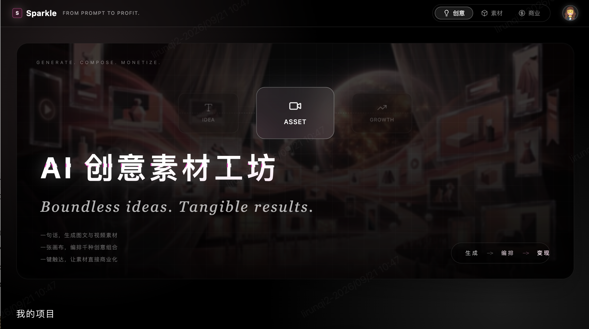

# Sparkle · AI 创意营销素材工坊

> **创意无界，增长有形。**
> *Boundless ideas. Tangible growth.*

**Sparkle is an AI-native infinite canvas that takes creative work from first idea to market-ready monetization assets.**

Sparkle 是一张 AI 原生的无限画布：从第一句创意描述开始，完成素材**生成**、**编排**，直到**商业化**，让创意直接变成可投放、可交易、可增长的营销素材。

   
  
   

---

## 目录

1. [产品定位](#1-产品定位)
2. [全链路工作流](#2-全链路工作流)
3. [核心功能](#3-核心功能)
4. [典型场景](#4-典型场景)

## 1. 产品定位

| 维度 | 说明 |
|---|---|
| **一句话定位** | AI 原生的无限画布，把创意从第一个想法带到可商用的营销素材 |
| **目标用户** | 品牌广告主、电商与增长团队、代理公司与创意工作室、独立创作者与素材生产者 |
| **核心价值** | 更快产出、风格一致、素材直接可商用、可变现 |
| **关键差异** | 不止于"生成"，覆盖 **生成 → 编排 → 商业化** 的完整链路 |

## 2. 全链路工作流

### 第一阶段：生成（Generate）

用一句话描述创意，得到可用的图片与视频素材。支持文生图、文生视频，并可基于参考图继续创作。

### 第二阶段：编排（Compose）

在无限画布上，把零散素材组织成完整的营销作品：并排对比、版式编排、多尺寸适配、团队协作，让"一堆素材"变成"一套 campaign"。

### 第三阶段：商业化（Monetize）

素材从画布直接走向市场：获得商用授权，进入素材生态，对接投放渠道，并把投放效果带回画布，指导下一轮创作，形成闭环。

---

## 3. 核心功能

### 3.1 创意生成 · Generate

| 功能 | 说明 |
|---|---|
| **文生图** | 输入一句话，生成海报、主视觉、产品场景图等静态素材 |
| **文生视频** | 输入一句话，生成短视频素材，适配信息流、短视频等广告形态 |
| **参考图生成** | 上传参考图或产品图，在保留主体的前提下生成新的场景与风格 |
| **批量变体** | 一个创意一次生成多种构图、风格与文案区版式，便于挑选与测试 |
| **品牌风格锁定** | 沉淀品牌的色彩、调性与元素，让不同批次的素材保持一致 |
| **多模型接入** | 按任务选择合适的生成模型，无需在多个工具间切换【待确认具体接入模型】 |

### 3.2 无限画布编排 · Compose

| 功能 | 说明 |
|---|---|
| **无限画布** | 没有边界的工作空间，所有生成结果、参考图、草稿平铺其上，一眼看全局 |
| **节点式工作流** | 把"提示词 → 生成 → 编辑 → 输出"串成可复用的流程，一次搭建，反复使用 |
| **并排对比** | 多个版本同屏排列，直观比较，快速筛选最优方案 |
| **版式与模板** | 预置广告常用版式（主视觉区、标题区、行动号召区），素材直接套用 |
| **多尺寸适配** | 同一创意一键适配竖版、方图、横幅等不同投放比例 |
| **团队协作** | 多人在同一张画布上协同，支持评论、版本记录与权限管理 |

### 3.3 商业化 · Monetize

| 功能 | 说明 |
|---|---|
| **商用授权** | 生成的素材附带明确的商用授权，可放心用于广告与营销【待确认授权条款】 |
| **素材库与交易** | 优质素材可沉淀为素材库，并在生态内流通与交易 |
| **投放对接** | 对接主流广告与内容平台，素材从画布直达投放【待确认具体渠道】 |
| **效果回流** | 投放数据回到画布，标注哪些素材表现好，指导下一轮生成与迭代 |
| **收益分成** | 创作者与素材提供方可基于素材使用获得收益【待确认分成机制】 |

### 3.4 生态 · Ecosystem

Sparkle 希望连接三类角色，让素材在其中流动：

- **广告主与品牌**：提出需求，获得高质量、可商用的素材；
- **创作者与工作室**：生产素材与工作流模板，通过使用与交易获得回报；
- **服务与渠道伙伴**：提供投放、分发与增值服务，共同扩大素材的商业价值。

---

## 4. 典型场景

| 场景 | 怎么用 Sparkle |
|---|---|
| **电商大促** | 上传商品图，批量生成不同风格的主图与短视频，一稿适配多个平台尺寸 |
| **品牌 Campaign** | 锁定品牌风格，在同一张画布上编排整套 campaign 的主视觉、物料与视频 |
| **游戏与应用买量** | 快速生成大量素材变体，配合投放数据回流，找到最优创意 |
| **代理与工作室** | 用节点工作流沉淀交付流程，缩短提案到出稿的周期 |
| **独立创作者** | 把作品做成可交易的素材与模板，在生态里持续获得收益 |

---
